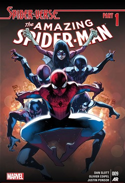

# Welcome to my Blog

by Ege Ergül

## 27-11-2024 / Spider-verse

**Brilliant! 👍**

I've just read the Spider-verse run (2014-2015) by Dan Slott, and it was one of the most breathtaking Marvel comic series I've ever read.

Regardless of how much of a super-hero geek you are, you have most definitely heard of Spider-Man before. And when Spider-Man: No Way Home hit theaters in 2021, we all became familiar with the "Spider-verse." As its name suggests, Spider-verse plots multi-verses. In the comics, many Spider-Men..., Spider-People..., Spider-Beings! gather to defeat the Inheritors. The [Inheritors](<https://marvel.fandom.com/wiki/Inheritors_(Earth-001)>) are a family of vampire-like monsters who are extremely powerful and feed on spiders. They feed on the life energy of Spider-beings. Our story begins with Peter saving Cindy Moon, a.k.a [Silk](<https://marvel.fandom.com/wiki/Cindy_Moon_(Earth-616)>) from a cell where she has been inprisoned for almost half of her life. Silk is a spider-woman who has been bit by the same radioactive spider that bate Peter. She was caged immediately after she gained her super-powers because her energy would attract [Morlun](<https://marvel.fandom.com/wiki/Morlun_(Earth-001)>) to their world. And when Peter breaks her out of her cage, this happens! Morlun notices Cindy and so the great hunt begins!

Some of the main characters are:

- Spider-Man (Our usual Peter Parker)
- Superior Spider-Man (Dr. Octavius in Peter's body! Long story)
- Spider-Woman
- Silk (Cindy Moon)
- Kaine (Peter's clone who has _unique_ powers...)
- Spider-Gwen
- Spider-Ham (my personal favourite)
- Spider-UK
- Spider-Punk
- Spider-Man (Miles Morales)
- and many, many, ...many more!

I believe the best part about this run is how differnt story lines run in parallel in harmony and all come together in the end. As story goes on, two different spider-groups gather up to fight back against the Inheritors. One is lead by the Superior Spider-Man (who has the mind of Dr. Octavius. Crazy, right?) and the other is lead by Peter Parker. Since when two huge spider-groups come together, they create a massive spider-energy which attracts their hunters to them. A huge battle happens and when things settle down, the story splits to 5 different branches. Each branch has its own run:

- **The Amazing Spider-Man:** The main story continues from the main story-line
- **Spider-Man 2099:** Six-armed Spider-Man, Spider-Man 2099, and Lady-Spider time-travels to 2099. They have defeated a clone of Daemos (one of the Inheritors). By investigating him, in 2099, they try to find a way to defeat the hunters.
- **Scarlet Spiders:** Ben Reilly, the Scarlet Spider (Kaine), Jessica Drew finds out that Jennix of the Inheritors has cloned each family member for thousands of times so when they die, they can be reborn. Which makes them practically immortal!
- **Spider-Woman:** Spider-Woman is responsible from protecting Silk from the hunters. Yet, things go out of control quickly and Spider-Woman finds herself in a Earth-001 (the home of Inheritors). And in this universe she is the lover of Morlun. By taking advantage of this _coincidence_, she gathers information about the Inheritors and the prophesy.
- **Spider-Verse Team-Up:** Miles and Spider-Man from the animated series goes on with their own journey to join other spider-people to their fight. In the comics I've read, this story line did not exists, so I couldn't read them. Probably this is the least important side story-line for the main plot. However I bet it is the most fun to read one!

In different issues from diferent runs, some events collide. Hence, we read the same action twice in different issues. Two different issues mean different authors and different artists as well. Reading the same dialog from different authors (both versions have similar but slightly different dialogs) and seeing different art styles is exciting. It reminds me that two people can experience the same occasion quite differently than each other. This makes me think that everyone is unique! Let's assume twin-brothers who are raised in the same house, go to the same school and enjoy the same social-group. Yet, it is possible that one brother remembers his childhood as fun and thrilling whereas the other remembers it as the exact opposite. Our reality is mostly shaped by our perception on things. So the easiest way to live our life is to put-on an optimistic point of view.

### **Let's talk about the artists!**

The Italian artist Giuseppe Camuncoli pencils the Amazing Spiderman 7-8, 12-15 and the Superior Spiderman 32-33. I was familiar with his work from Darth Vader (2017 - 2018), and he stunned me with his work in this run as well. The dynamic poses he protrayed Spider-Man maximizes the joy of reading comic books.

Another fascinating artist that catched my attention with his magnificent art is Olivier Coipel. The French artist penciled the Amazing Spiderman 9-11, 14. In issue 11, our good-old Peter Parker faces Dr. Octavius who had taken his place for months and in result caused Peter tons of trouble. The first time when these Spider-men come together face to face for the first time after their history is awfully tense. And the brilliant penciling of Coipel reflects this tension just quite right. His art succesfully reflects two opposite personalities in the same-looking bodies. The cold and egoist characteristic of Dr. Octavius and the goofy and gullable personality of Peter are easily noticible by the way they are drawn.

### **But...**

There are some things that I do not appreciate as much about this comic-series as well.

- What is the motivation behind the Inheritors? At the end of the comics, it is revealed that they can survive by eating any animal. So why are they obsessed with spiders? And why they are obsessed with Spider-people? They could just eat normal animals as well...
- Why Molun is alerted after Silk is freed? In Silk's world, there are many other Spider-people. So why does the great hunt begins with the breake-out of Silk?
- What's up with the prophecy? It seems like, the prophecy has randomly chosen 3 spider-people. What makes the selected 3 spider-people special is not explained enough, or at all...
- Whose idea was it to not kill the Inheritors at the end? Of course Spider-man doesn't kill. **But!** Come on! They will escape eventually. They have been genociding your race for ages, so they just will not learn what they do is wrong.
- I personally didn't like the ending. A lot of things happened in the last issue, which seemed a litlle bit cursory. I think the last issue could be made in two seperate issues. OR, the entire ending could have been deleted and changed. I think that would be even better. A simpler ending would be more elegant in my opinion.
- Finally, the most important thing that doesn't make sense to me is this: How the hell the bit of a radioactive spider didn't kill Peter Parker? But I guess, this question is not directly related to the Spider-Verse run.

Over all, I enjoyed reading this series. After all, you don't get to see a pork in a red suit swinging and joking around every day!
